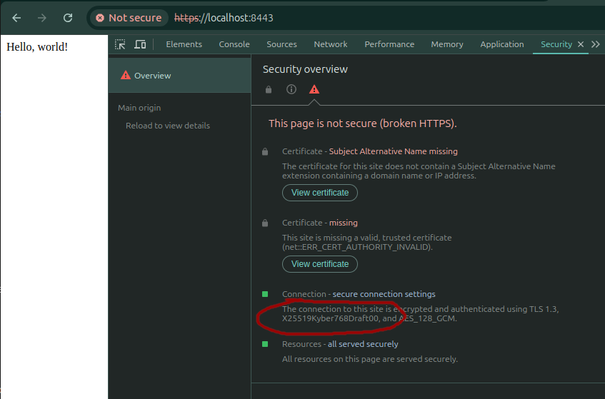

# Quantum Blogserver

The primary purpose of this repo is to try out Go 1.23rc2, and its Post Quantum Cryptography features in TLS.

This is a simple webserver written in Go. When compiled using Go 1.23rc2, it uses an X25519/Kyber768 hybrid cryptography
key exchange mechanism. The webserver is for hosting static sites.

## Compiling

`make build`

## Running

`./bin/quantumblogserver run --config ./config/.env`

## Configuration

The tool can be configured with a `.env` file, or with environment variables. See `./config/.env.example` for values.

## Result

Your static site should be being served using the `X25519Kyber768Draft00` cyphersuite. You can see that in Chrome dev
tools here:

That means you are using Post-Quantum Cryptography with Go 1.23rc2.
